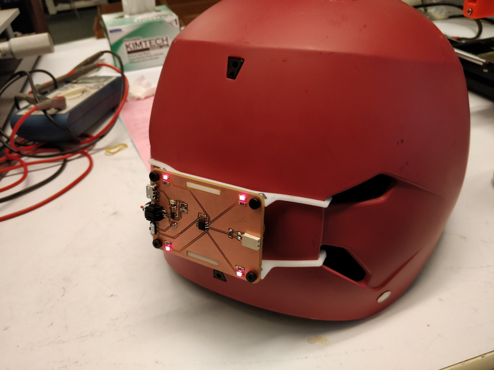
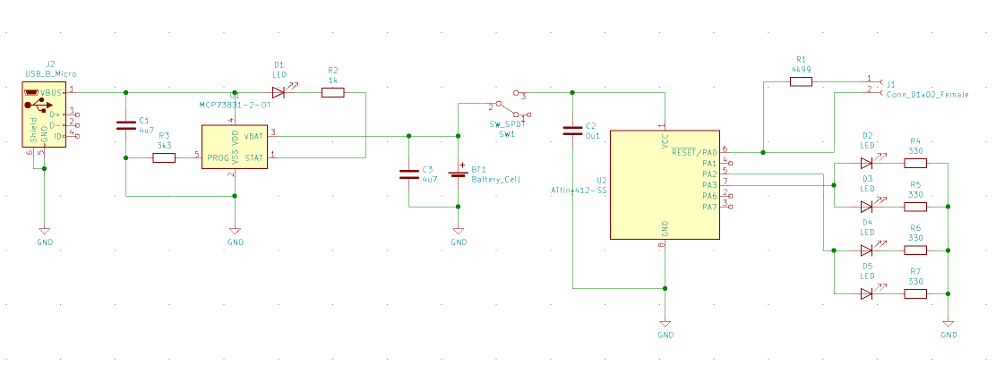
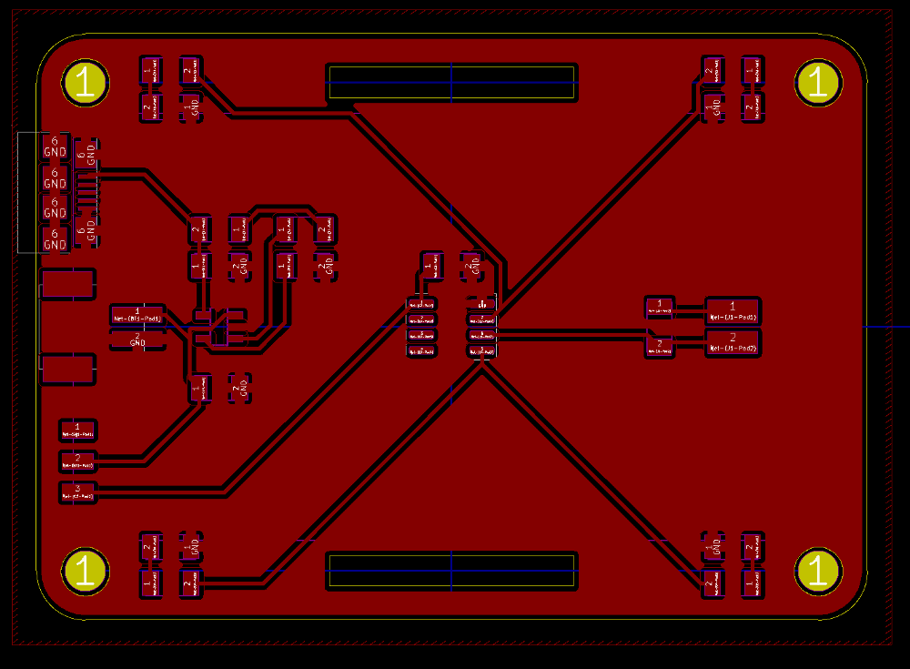
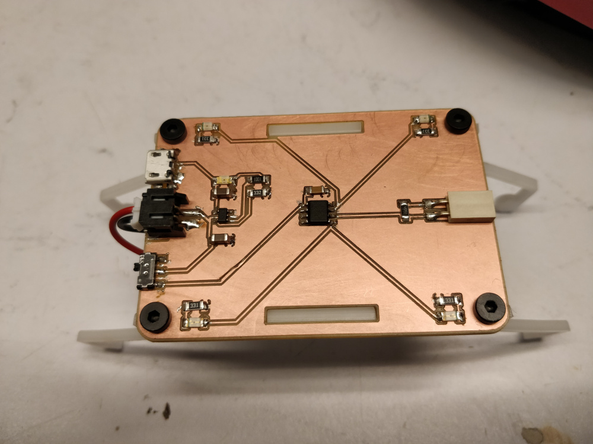
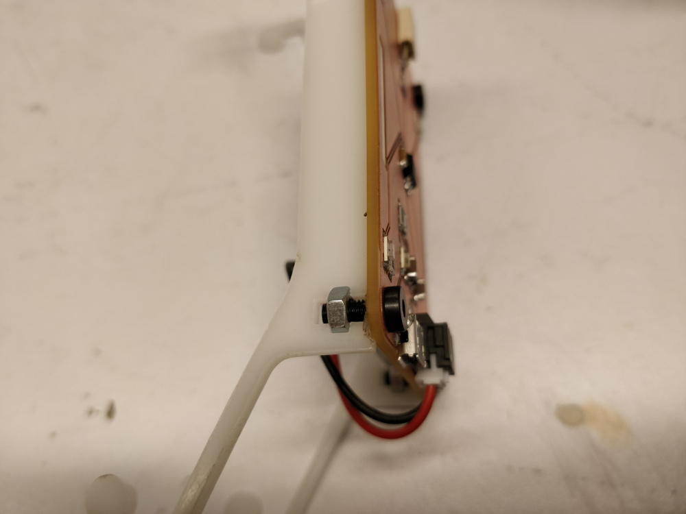
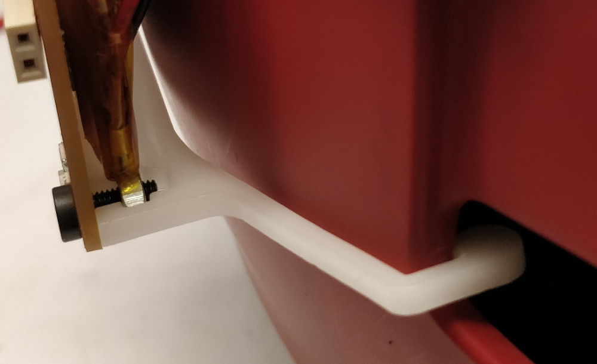
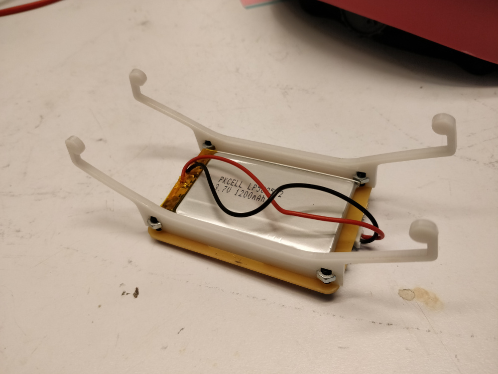

## bikelight

It's a blinky red light for the back of my bike helmet.

The circuit uses an ATtiny412 to control four red LEDs, along with a Microchip MCP73831 lipo charge controller for battery management and a micro-USB jack for charging.

The circuit is designed to be milled on a single sided chunk of FR1 using a 1/64" end mill. If you use [mods](mods.cba.mit.edu), the three layer *.svg files (holes, outline, and traces) are in the /pcb directory.

The pcb attaches using M3 hardware to two laser cut acetal clips, which then snap into [my helmet](https://www.bernhelmets.com/collections/bike/products/summer-watts?variant=13190223200315). If you have the same model, this will probably work for you too, otherwise you'll need to figure something else out. Laser cut files for these parts are in the /cad directory, intended to be cut from 2.5 mm acetal.

I used a 1200 mAH lipo battery since we had a few on hand; it's secured to the rear of the pcb using VHB tape. I snagged a JST PH off a spare Feather, but if you plan ahead you can buy the part [here](https://www.adafruit.com/product/1769). Note that lipo batteries are inherently dangerous, so don't build this circuit unless you're familiar with their quirks (and make sure to use one with a built-in protection circuit). Yes, if my helmet ever actually has to do its job, my head will likely catch fire.

bikelight! blink blink blink blink blink
